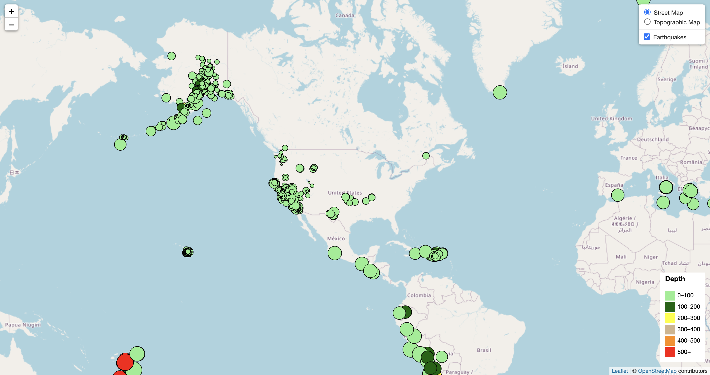

# leaflet-challenge
GT Data Bootcamp leaflet-challenge

## Earthquakes from the last 7 days

Website diplaying the earthquakes in the last 7 days with magnitude and depth. GEOjson from [USGS](https://earthquake.usgs.gov/earthquakes/feed/v1.0/geojson.php)

